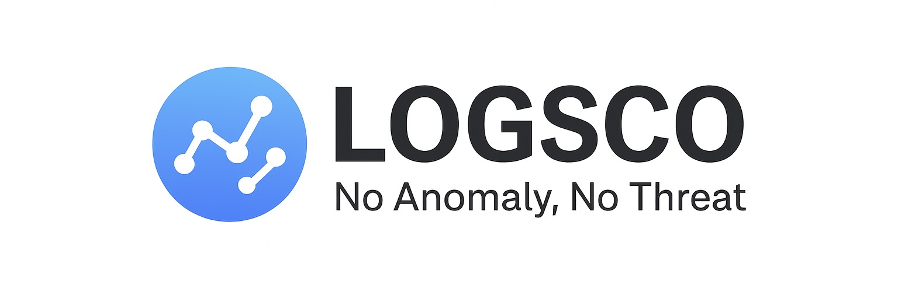

<!-- LOGSCO HEADER -->


[](./LICENSE)
[](https://www.python.org/)
[](https://www.docker.com/)
[](https://conventionalcommits.org)


---

# LOGSCO  
**AI 기반 이상로그 탐지 서비스 (AI-Powered Log Scoring & Analysis System)**  

스마트 로그 분석과 이상 탐지를 자동화하는 오픈소스 툴킷입니다.  
[시연 영상 보기](https://www.youtube.com/playlist?list=PLJOyfcewGGvYWiry_4vStBUEzOWpJ6w07)

운영체제별 가이드북 (Windows, Mac) <br />
Windows: https://www.notion.so/1bed038712de802fa97bce2017e43859?source=copy_link   <br />
Mac: https://www.notion.so/2420363bd07c807191bde6b6acfee091?source=copy_link <br />

---

## 1. LOGSCO 소개  

**LOGSCO**는 대규모 보안 로그에서 **AI 기반 이상 패턴을 자동 탐지**하는 플랫폼입니다.  
데이터 흐름을 “점과 선(노드와 관계)”로 파악하여,  
복잡한 로그 안에서도 비정상 행위를 직관적으로 찾아냅니다.  

> LOGSCO의 목표는 단순한 탐지가 아닌,  
> **‘데이터의 연결 관계 속에서 이상을 이해하는 것’** 입니다.

---

## 2. 로고의 의미  

| 구성요소 | 의미 |
|-----------|------|
| 파란색 원 | 신뢰·보안·데이터의 안정성을 상징하며, LOGSCO의 분석 범위를 표현 |
| 노드 + 연결선 | 로그 이벤트 간 상관관계, AI가 학습하는 데이터 흐름의 시각화 |
| 원형 구조 | 폐쇄된 보안 경계와 자율 탐지 시스템의 완결성 상징 |

> LOGSCO는 **데이터의 연결을 이해하고, 관계 속에서 비정상을 감지하는 AI 시스템**을 의미합니다.

🔗 [LOGSCO 아이콘](./docs/images/icon.png)

---

## 3. 주요 기능  

- PyCaret 기반 **AI 이상탐지 자동화**
- **Threshold 직접 설정 기능** (사용자 맞춤 조정)
- Plotly 기반 **이상치 시각화 그래프**
- **Docker 완전 지원**, 1분 내 실행 가능
- **온프레미스(오프라인)** 환경 지원  

> ⚙️ **업로드 제한 안내**  
> - 기본적으로 10분 이하의 로그 데이터만 업로드 가능합니다.  
> - 더 큰 데이터는 [GitHub Issue](https://github.com/whs3-mujo/anomaly-toolkit/issues)를 통해 문의해주세요.  
>   (기술적으로 가능하지만, 서비스 효율성을 위해 제한되어 있습니다.)

---

## 4. 샘플 데이터  

**파일명:** [Final_Fintech_Security_Logs.csv](./docs/samples)<br />
**설명:** 실제 금융기관 로그 환경 기반의 보안 로그 샘플

| 컬럼명 | 설명 |
|--------|------|
| timestamp | 로그 발생 시각 |
| user_id | 사용자 식별자 |
| event_type | 이벤트 유형 |
| ip_address | 접속 IP 주소 |
| process_name | 실행된 프로세스 이름 |
| anomaly_score | AI 이상치 점수 |

**사용 예시**
```bash
python manage.py runserver
# 웹 대시보드 접속 후 Final_Fintech_Security_Logs.csv 업로드
```

---

## 5. Docker 실행 가이드  

### 1) Docker 설치  
[Docker Desktop 다운로드](https://www.docker.com/products/docker-desktop)

### 2) 버전 확인  
```bash
docker --version
docker compose version
```

### 3) 파일 다운로드 
[Docker 이미지•실행 파일 다운로드](https://drive.google.com/drive/folders/1nwI_TW3FTxpsm7FXuqzWbMWsnxUHTQAQ?usp=sharing)

### 4) 다운로드한 압축 파일을 새로운 폴더에 압축 해제 후 이동
Windows)
anomaly-toolkit-offline-windows.zip 파일 압축 해제

MacOS) 
명령어 입력
```bash
tar -xzf anomaly-toolkit-offline-macos-arm64.tar.gz
chmod +x *.sh
```

### 5) 폴더 내 실행 스크립트 실행
Windows)
```bash
   a. setup.bat 파일을 더블클릭하여 실행(최초 1회)
   b. 서비스 시작 - start_service.bat 파일을 더블클릭하여 실행

   * 종료: stop_service.bat 파일 실행
```
MacOS)
```bash
   # a. 초기 설정 (최초 1회)
   ./setup.sh
   # b. 서비스 시작
   ./start_service.sh

   *종료: 
   ./stop_service.sh 실행
```

**접속 경로**
- 업로드: http://localhost:8000/upload  
- 대시보드: http://localhost:8000/dashboard  

**트러블 슈팅**
  문제상황 | 해결방법 |
  |-----------|------|
  | 포트 8000 사용중 | 다른 프로그램 종료 후 재시작 |
  | Docker 오류 | Docker Desktop 재시작 |
  | 도커 이미지 로딩 오류(윈도우) | Docker Hub에서 이미지 직접 다운로드(docker pull ynjii/anomaly-toolkit:windows-latest) |
  | 업로드 실패 | 파일 확장자, 용량 확인 |
---

## 6. 개발자 환경 세팅  

```bash
# 1. python 3.11로 가상환경 생성 및 활성화
virtualenv --python=3.11 .venv 또는 py -3.11 -m venv .venv

가상환경 활성화
. .venv/bin/activate 또는 . .venv\Scripts\Activate.ps1

# 2. 의존성 설치
pip install -r requirements.txt

# 3. 마이그레이션
python manage.py makemigrations
python manage.py migrate

# 4. 관리자 계정 생성(생략 가능)
python manage.py createsuperuser

# 5. SECRET_KEY 등록(필수)
export SECRET_KEY=[비밀키]

**오류 발생 시 직접`.env` 파일 내 아래 내용 작성**
SECRET_KEY=YOUR_SECRET_KEY

# 6. 서버 실행
python manage.py runserver 0.0.0.0:8000
또는
python manage.py runserver
```

---

## 7. 팀 구성  

| 이름 | 역할 | GitHub |
|------|------|---------|
| 김윤지 | 웹 개발 총괄 / DevOps / PM | [@ynjii](https://github.com/ynjii) |
| 김지윤 | 대시보드 UI / Frontend | [@JIYUN02](https://github.com/JIYUN02) |
| 백형철 | 그래프 UI / Cross-role | [@BAEK10000](https://github.com/BAEK10000) |
| 심준호 | 라이선스 관리 / License | [@junho462](https://github.com/junho462) |
| 이준혁 | AI 모델링 / Backend | [@hubkorea](https://github.com/hubkorea) |
| 정원재 | 데이터 엔지니어링 / Backend | [@daljoa](https://github.com/daljoa) |
| 정채윤 | AI 연구 / Backend | [@jcy333](https://github.com/jcy333) |
| 최아현 | AI 개발 / Backend | [@ChoiAh](https://github.com/ChoiAh) |

---

## 8. 기여 (Contributing)

LOGSCO 프로젝트에 기여하려면 아래 절차를 따르세요.

```bash
# 1. 포크 후 브랜치 생성
git checkout -b feature/새기능명

# 2. 코드 수정 및 커밋
git commit -m "feat: 새 기능 요약"

# 3. PR 생성
git push origin feature/새기능명
```

**PR 규칙**
- 제목은 *Conventional Commit* 규칙을 따릅니다.  
- 예: `fix: threshold 슬라이더 오류 수정`  
- 자세한 가이드는 [`CONTRIBUTING.md`](./docs/CONTRIBUTING.md) 참고

---

## 9. 오픈소스 라이선스  

### 메인 라이선스  

본 프로젝트는 **MIT License** 하에 배포됩니다.  
© 2025 TEAM LOGSCO  
모든 사용자는 자유롭게 이용·수정·배포할 수 있으며,  
원 저작권 표기와 라이선스 전문을 포함해야 합니다.  
소프트웨어는 **보증 없이 "있는 그대로(AS IS)" 제공**됩니다.  
[전체 전문 보기](./LICENSE)

---

### 포함된 외부 라이브러리  

LOGSCO는 다음 오픈소스 라이브러리들을 포함합니다.  
세부 정보는 [`notice.txt`](./docs/notice.txt)에서 확인할 수 있습니다.

| 라이브러리 | 버전 | 라이선스 | 비고 |
|-------------|-------|-----------|------|
| Django | 5.2.7 | BSD 3-Clause | 웹 프레임워크 |
| gunicorn | 23.0.0 | MIT | WSGI 서버 |
| python-dotenv | 1.1.1 | BSD 3-Clause | 환경변수 관리 |
| pandas | 2.3.3 | BSD 3-Clause | 데이터 처리 |
| scikit-learn | 1.7.2 | BSD 3-Clause | ML 알고리즘 |
| numpy | 2.3.3 | BSD 3-Clause | 수치 계산 |
| pyod | 2.0.5 | BSD 2-Clause | 이상탐지 모델 |
| shap | 0.48.0 | MIT | 모델 해석용 |
| plotly | 6.3.1 | MIT | 시각화 라이브러리 |
| chardet | 5.2.0 | LGPL 2.1-or-later | 인코딩 탐지기 |
| category-encoders | 2.81 | BSD 3-Clause | 데이터 전처리 |
| joblib | 1.5.2 | BSD 3-Clause | 병렬처리 유틸리티 |

---

## 10. License Summary  

- **Main Project:** MIT License (TEAM LOGSCO)  
- **Sub Libraries:** BSD, MIT, LGPL (see notice.txt)  
- **Distribution:** 자유로운 사용/수정/상용 배포 가능  
- **Obligation:** 원저작권 표시 및 notice 파일 포함 필수  

---

### LOGSCO — 로그에서 인사이트로  
AI와 함께, 더 똑똑한 로그 보안을 경험하세요.
